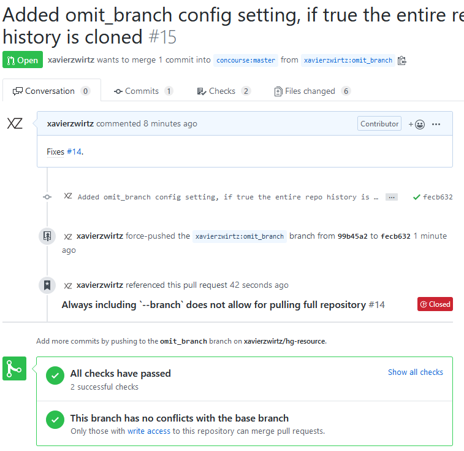

# Brain

## Projects

Projects are the fundamental datastructure for project management in brain.
When opening a project, a title must be supplied, and an opening comment can be
supplied as well. While a project is worked by the users of the system, further
discussion will be included in comments on the issue. To support complex
projects, a project can have sub-projects created beneath it. 

### Project Events

Similar to github, when viewing a project the data that is displayed will not
just be comments, but a stream of all events on the project. Adding a comment
is an event, as well as commits being added to the project, builds being
completed, sub projects being added and completed, and timeslips being run against it. 
Prior art from github below

## Removal of Task concept

Tasks currently model both messages between users, and a unit of work that
needs to be completed. The unit of work concept will be subsumed by the
project, with all time tracking done at the project and discussion of the issue
done with comments on the project. 

Imagine the scenario where John sends Bill a task to "Deploy a new build of
FixIssue to ACME". In the new system this would instead be done by John going
to the project that spawned the need for a deployment, and adding the comment
"@Bill, deploy a new build of FixIssue"

Imagine the scenario where project manager John sends techician Bill a task to
"Deploy a new build of FixIssue to ACME". In the new system this would instead
be done by John going to the project that spawned the need for a deployment,
and adding the sub-project "Deploy a new build of FixIssue" and assigning it to
Bill. Bill would recieve a notification in his inbox that he has been assigned
a project, and can accept it onto assigned project list, or reject it with a
message. While the project is waiting on acceptance by Bill it would be marked
as "Waiting for acceptance". If Bill accepted the project, the project would
have its owner changed from John to Bill, and John would be left as a watcher.
If instead Bill rejected the project with the reason "No, that would not fix
the issue" the owner would not change, and John would get a rejection message
in his inbox, allowing him to move the project forward with that knowledge.
Going back to the case where Bill accepts ownership of the project, the project
would be in Bills list of owned projects until he passed it off. Ideally, since
Bill is a technician his owned project list would be very minimal. When Bill
goes to work on the project, he would start a time entry on it. During work on
the project, Bill would add comments to the project with any relevant
information he discovers. Whenever it is time for him to stop for the day, or
move onto something else he would stop his time entry, which would give him a
prompt asking for notes on the time entry. The time entry will contain a list
of projects and comments that were changed during the completion of a time
entry. Once Bill is done with the project, he will make any notes in a comment,
and close the project. Since John is a watcher on the project, he will recieve
a message in his inbox.